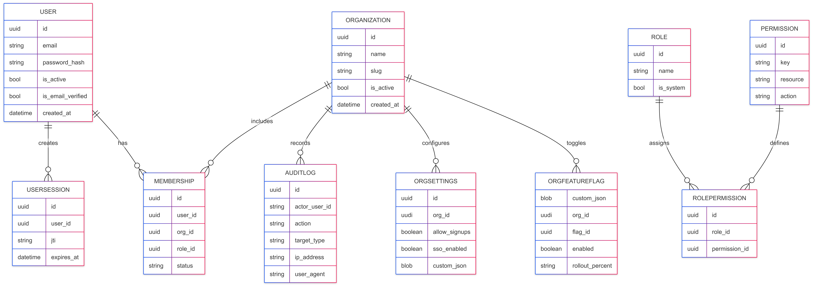
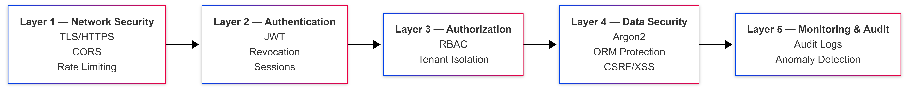
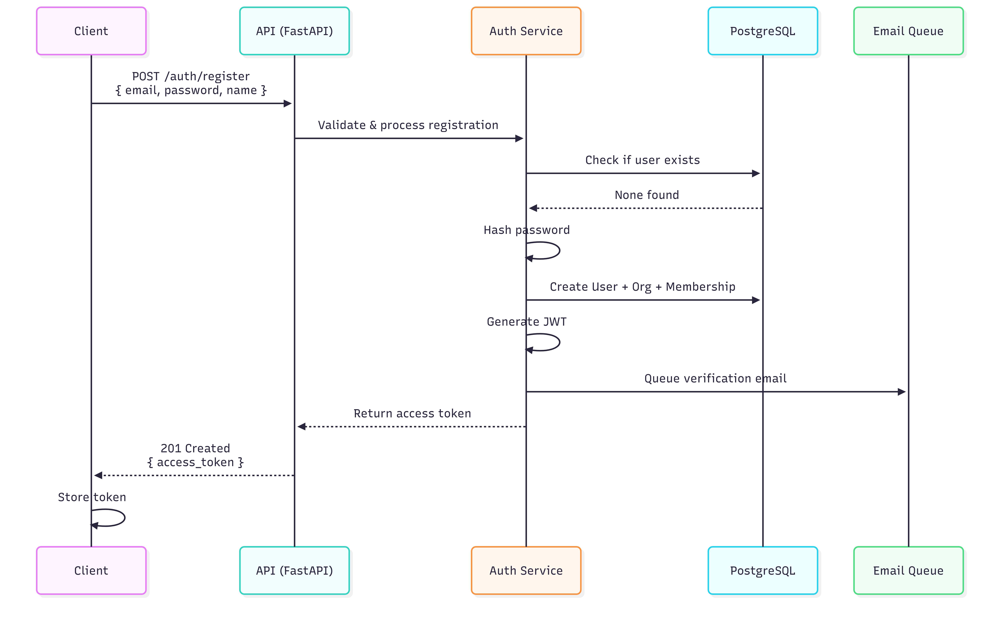
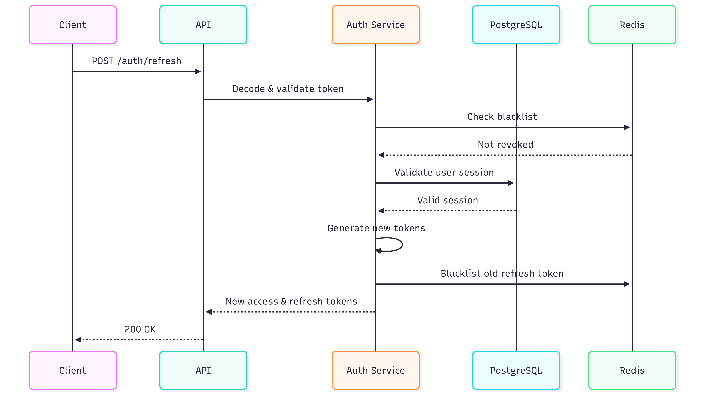

# 🏗️ SaaSReady Architecture Documentation

> **Enterprise-grade multi-tenant authentication platform architecture**

---

## 📋 Table of Contents

- [System Overview](#system-overview)
- [Core Components](#core-components)
- [Data Architecture](#data-architecture)
- [Security Architecture](#security-architecture)
- [Authentication Flows](#authentication-flows)
- [Authorization Model](#authorization-model)
- [API Architecture](#api-architecture)
- [Infrastructure & Deployment](#infrastructure--deployment)
- [Scalability Considerations](#scalability-considerations)

---

## 🌐 System Overview


### **High-Level Architecture**


### **Technology Stack**

| Layer | Technology | Purpose |
|-------|-----------|---------|
| **Frontend** | Next.js 14 + TypeScript | Server-side rendering, type safety |
| **Backend** | FastAPI + Python 3.11+ | High-performance async API |
| **Database** | PostgreSQL 15+ | Primary data store |
| **Cache** | Redis 7+ | Rate limiting, sessions, caching |
| **Email** | SendGrid/AWS SES | Transactional emails |
| **Auth** | JWT + Argon2 | Token-based authentication |
| **ORM** | SQLAlchemy 2.0 | Database abstraction |
| **Migrations** | Alembic | Schema versioning |

---

## 🧩 Core Components

### **1. Authentication Service**

**Responsibilities:**
- User registration with validation
- Login with brute force protection
- JWT token generation and validation
- Token revocation and blacklisting
- Password reset flows
- Email verification
- 2FA/TOTP management

**Key Features:**
```python
class AuthService:
    - register_user()          # Creates user + personal org
    - login_user()             # Validates credentials + 2FA
    - verify_email()           # Email verification flow
    - request_password_reset() # Sends reset link
    - reset_password()         # Completes password reset
    - change_password()        # Authenticated password change
    - setup_2fa()              # Generates TOTP secret + QR
    - verify_2fa()             # Validates TOTP code
```

**Security Layers:**
1. **Rate Limiting**: 5 login attempts per minute
2. **Brute Force Protection**: Progressive delays + account lockout
3. **Device Fingerprinting**: Tracks suspicious patterns
4. **Token Revocation**: Instant logout via blacklist
5. **Session Management**: Maximum 5 concurrent sessions

### **2. Organization Service**

**Responsibilities:**
- Multi-tenant workspace management
- Member invitation system
- Role assignment
- Organization settings

**Key Features:**
```python
class OrgService:
    - create_organization()    # Creates tenant workspace
    - invite_user()            # Email invitation flow
    - update_member_role()     # Role assignment
    - get_organization_members() # Member listing
```

**Invitation Flow:**
```
Inviter → OrgService.invite_user() →
  ├─ User exists?
  │  ├─ Yes → Create membership (invited status)
  │  └─ No  → Create placeholder user + membership
  └─ EmailService.send_invitation() →
     └─ Async queue with retry mechanism
```

### **3. RBAC Service**

**Responsibilities:**
- Permission checking
- Role hierarchy enforcement
- Custom role management

**Permission Model:**
```python
Permission = {
    "key": "org.update",      # Unique identifier
    "resource": "org",        # Resource type
    "action": "update",       # Action type
    "description": "Modify organization settings"
}

Role ──1:N──> RolePermission ──N:1──> Permission
```

**Built-in Roles:**

| Role | Hierarchy | Permissions |
|------|-----------|-------------|
| **Owner** | 4 | Full access (all permissions) |
| **Admin** | 3 | Manage users, settings, view audit |
| **Member** | 2 | View organization, basic access |
| **Viewer** | 1 | Read-only access |

### **4. Audit Service**

**Responsibilities:**
- Track all security events
- Log user actions
- Store request metadata (IP, User-Agent)
- Queryable log history

**Tracked Events:**
- `user.registered`, `user.logged_in`, `user.logout`
- `user.invite.sent`, `user.invite.accepted`
- `user.role.updated`, `user.removed`
- `org.created`, `org.updated`
- `security.password.changed`, `security.2fa.enabled`

### **5. Feature Flag Service**

**Responsibilities:**
- Global feature flag management
- Organization-level overrides
- Percentage-based rollouts

**Flag Evaluation:**
```python
def is_enabled(org_id, flag_key):
    override = get_org_override(org_id, flag_key)
    if override:
        return override.enabled
    
    flag = get_global_flag(flag_key)
    return flag.default_enabled
```

---

## 🗄️ Data Architecture

### **Entity Relationship Diagram**




### **Database Indexes**

**Critical Indexes:**
```sql
-- User lookups
CREATE INDEX idx_users_email ON users(email);
CREATE INDEX idx_users_active ON users(is_active) WHERE is_active = true;

-- Token revocation (fast lookups)
CREATE INDEX idx_token_blacklist_jti ON token_blacklist(jti);
CREATE INDEX idx_token_blacklist_expires ON token_blacklist(expires_at);

-- Organization memberships
CREATE INDEX idx_memberships_user_org ON memberships(user_id, organization_id);
CREATE INDEX idx_memberships_org_status ON memberships(organization_id, status);

-- Audit logs (time-series)
CREATE INDEX idx_audit_logs_org_time ON audit_logs(organization_id, created_at DESC);
CREATE INDEX idx_audit_logs_actor ON audit_logs(actor_user_id);

-- Login attempts (security)
CREATE INDEX idx_login_attempts_composite ON login_attempts(identifier, device_id, attempted_at);
```

---

## 🔒 Security Architecture

### **Defense in Depth**



### **Token Security**

**JWT Structure:**
```json
{
  "header": {
    "alg": "HS256",
    "typ": "JWT"
  },
  "payload": {
    "sub": "user-uuid",
    "exp": 1640000000,
    "iat": 1639993200,
    "jti": "unique-token-id",
    "type": "access"
  }
}
```

**Token Lifecycle:**
```
1. Login → Generate JWT (exp: 7 days)
2. Store JTI in UserSession table
3. Every request → Validate JWT + Check blacklist
4. Logout → Add JTI to TokenBlacklist
5. Background job → Cleanup expired tokens
```

**Revocation Strategy:**
- Immediate: Add JTI to blacklist table
- Eventual: Cleanup expired tokens (cron job)
- Distributed: Redis cache for fast lookups

---

## 🔐 Authentication Flows

### **1. Registration Flow**


### **2. Login Flow with 2FA**


### **3. Token Refresh Flow**

---

## 🛡️ Authorization Model

### **Permission Check Fl
ow**
.png)


### **Permission Enforcement**

**Method 1: Dependency Injection**
```python
@router.patch("/{org_id}")
def update_org(
    org_id: str,
    membership: Membership = Depends(require_permission("org.update"))
):
    # Only users with org.update permission reach here
    pass
```

**Method 2: Service Layer**
```python
class RBACService:
    def has_permission(self, membership, permission_key):
        # Query RolePermission table
        return exists(membership.role_id, permission_key)
```

### **Role Hierarchy Enforcement**

```python
HIERARCHY = {
    "owner": 4,
    "admin": 3,
    "member": 2,
    "viewer": 1
}

def can_assign_role(actor_role, target_role):
    # Owner can assign any role
    if actor_role == "owner":
        return True
    
    # Others can only assign equal or lower roles
    return HIERARCHY[actor_role] > HIERARCHY[target_role]
```

---

## 🌐 API Architecture

### **Request Processing Pipeline**

```
HTTP Request
    ↓
CORS Middleware
    ↓
Security Headers Middleware
    ↓
Request ID Middleware
    ↓
Rate Limit Middleware
    ↓
Authentication (JWT Decode)
    ↓
Authorization (Permission Check)
    ↓
Route Handler
    ↓
Service Layer
    ↓
Database
    ↓
Response
```

### **Error Handling Strategy**

```python
try:
    result = service.perform_action()
except ValidationError:
    return 422 UNPROCESSABLE_ENTITY
except AuthenticationError:
    return 401 UNAUTHORIZED
except AuthorizationError:
    return 403 FORBIDDEN
except NotFoundError:
    return 404 NOT_FOUND
except RateLimitError:
    return 429 TOO_MANY_REQUESTS
except Exception:
    log.error(traceback)
    return 500 INTERNAL_SERVER_ERROR
```

### **API Versioning**

```
/api/v1/auth/login
/api/v1/orgs
/api/v2/orgs  (future)
```

---

## 🚀 Infrastructure & Deployment

### **Single-Server Architecture (Starter)**

```
┌─────────────────────────────────────────┐
│         Single Server (4GB RAM)          │
│                                          │
│  ┌────────────┐  ┌────────────┐        │
│  │  Frontend  │  │  Backend   │        │
│  │  (Next.js) │  │  (FastAPI) │        │
│  │  Port 3000 │  │  Port 8000 │        │
│  └────────────┘  └────────────┘        │
│                                          │
│  ┌────────────┐  ┌────────────┐        │
│  │ PostgreSQL │  │   Redis    │        │
│  │  Port 5432 │  │  Port 6379 │        │
│  └────────────┘  └────────────┘        │
└─────────────────────────────────────────┘
```

### **Production Architecture (Scalable)**

```
                    ┌──────────────┐
                    │ Load Balancer│
                    │  (Nginx/ALB) │
                    └───────┬──────┘
                            │
        ┌───────────────────┼───────────────────┐
        │                   │                   │
┌───────▼──────┐   ┌────────▼──────┐   ┌───────▼──────┐
│   Frontend   │   │   Frontend    │   │   Frontend   │
│   Instance 1 │   │   Instance 2  │   │   Instance 3 │
└──────────────┘   └───────────────┘   └──────────────┘

                    ┌──────────────┐
                    │ API Gateway  │
                    │  (Kong/Nginx)│
                    └───────┬──────┘
                            │
        ┌───────────────────┼───────────────────┐
        │                   │                   │
┌───────▼──────┐   ┌────────▼──────┐   ┌───────▼──────┐
│   Backend    │   │   Backend     │   │   Backend    │
│   Worker 1   │   │   Worker 2    │   │   Worker 3   │
└──────┬───────┘   └───────┬───────┘   └───────┬──────┘
       │                   │                   │
       └───────────────────┼───────────────────┘
                           │
        ┌──────────────────┼──────────────────┐
        │                  │                  │
┌───────▼─────────┐ ┌──────▼──────┐ ┌────────▼────────┐
│  PostgreSQL     │ │    Redis    │ │  Email Service  │
│  (Primary +     │ │  (Cluster)  │ │  (SendGrid/SES) │
│   Replicas)     │ │             │ │                 │
└─────────────────┘ └─────────────┘ └─────────────────┘
```

### **Database Scaling Strategy**

**Phase 1: Single Instance (0-10K users)**
- Single PostgreSQL server
- Regular backups
- Connection pooling (20 connections)

**Phase 2: Read Replicas (10K-100K users)**
- Primary for writes
- 1-2 read replicas for queries
- Connection pool per instance

**Phase 3: Sharding (100K+ users)**
- Shard by organization_id
- Keep auth in primary
- Distribute organizations

### **Caching Strategy**

```python
# Level 1: Application Cache (Redis)
@cache(ttl=300)  # 5 minutes
def get_user_permissions(user_id, org_id):
    return db.query(...)

# Level 2: Database Query Cache
SELECT * FROM users WHERE id = ? 
-- PostgreSQL query planner cache

# Level 3: CDN Cache (Static Assets)
# Cache-Control: public, max-age=31536000
```

---

## 📊 Scalability Considerations

### **Bottleneck Analysis**

| Component | Limit | Mitigation |
|-----------|-------|------------|
| **Database Connections** | 100 concurrent | Connection pooling + Read replicas |
| **JWT Validation** | CPU-bound | Cache decoded tokens in Redis |
| **Token Blacklist** | Memory-bound | Time-based eviction + Redis |
| **Email Queue** | Network I/O | Async queue + batch sending |
| **Rate Limiting** | Memory-bound | Redis sorted sets |

### **Performance Targets**

- **API Response Time**: p95 < 200ms
- **Authentication**: < 500ms (with 2FA)
- **Database Queries**: < 50ms (indexed)
- **Token Validation**: < 10ms (cached)
- **Throughput**: 1000 req/s per backend instance

### **Monitoring Stack**

```
Application Metrics → Prometheus
    ↓
Visualization → Grafana
    ↓
Alerting → PagerDuty/Slack
    ↓
Logs → ELK Stack / Datadog
```

**Key Metrics:**
- Request rate & latency (p50, p95, p99)
- Error rate by endpoint
- Database connection pool usage
- Redis cache hit ratio
- JWT validation time
- Authentication success rate
- Active user sessions

---

## 🔄 Background Jobs

```python
# Cleanup Tasks (Run Hourly)
class BackgroundTasks:
    def cleanup_expired_tokens(self):
        # Remove TokenBlacklist entries past expires_at
        
    def cleanup_inactive_sessions(self):
        # Mark UserSession as inactive
        
    def process_email_retry_queue(self):
        # Retry failed emails
        
    def cleanup_old_login_attempts(self):
        # Remove LoginAttempt records > 90 days
```

---

## 📈 Future Architecture Enhancements

### **Planned Improvements**

1. **Async Workers**: Celery for background tasks
2. **Event Streaming**: Kafka for audit logs
3. **GraphQL API**: Alternative to REST
4. **gRPC Services**: Inter-service communication
5. **Service Mesh**: Istio for microservices
6. **Read/Write Splitting**: Automatic routing
7. **Time-Series DB**: For audit logs (TimescaleDB)
8. **Object Storage**: S3 for file uploads

---

## 📚 Additional Resources

- [API Documentation](./api-reference.md)
- [Security Model](../SECURITY.md)
- [Deployment Guide](./deployment.md)

---

**Last Updated**: January 2025  
**Architecture Version**: 1.0